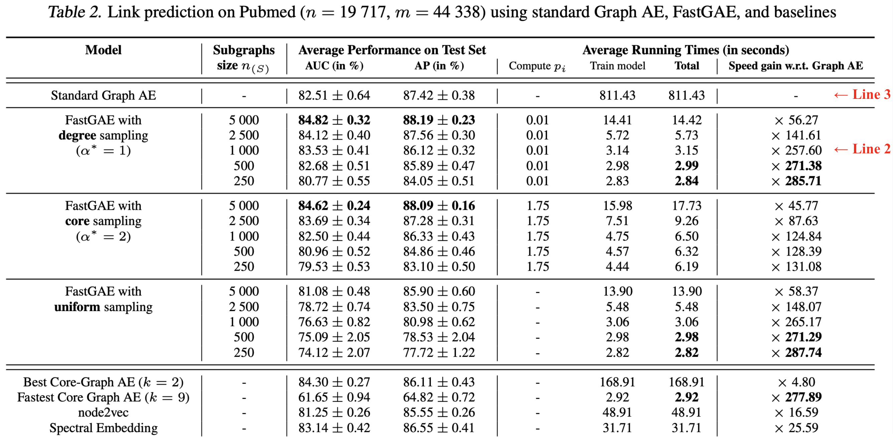

# FastGAE

This repository provides a Tensorflow implementation of the **FastGAE** framework, introduced in the article [FastGAE: Fast, Scalable and Effective Graph Autoencoders with Stochastic Subgraph Decoding](https://arxiv.org/pdf/2002.01910.pdf). This framework aims at speeding up **Graph Autoencoders (AE)** and **Graph Variational Autoencoders (VAE)**, and at scaling these models to large graphs with millions of nodes and edges.

We evaluate FastGAE on the **link prediction** and **node clustering** tasks introduced in the paper. We provide the Cora, Citeseer, Pubmed and Google datasets in the `data` folder. The three additional graphs used in the paper (SBM, Patent and Youtube) will later be provided via external links due to size constraints. We refer to section 4 of the paper for more information about datasets.

Our code builds upon Thomas Kipf's [original implementation](https://github.com/tkipf/gae) of graph AE and VAE, and upon [previous research works](https://github.com/deezer/linear_graph_autoencoders) from our team.


## Installation

```bash
python setup.py install
```

Requirements: tensorflow (1.X), networkx, numpy, scikit-learn, scipy


## Run Experiments

```bash
cd fastgae
python train.py --model=gcn_ae --dataset=pubmed --task=link_prediction --fastgae=True --measure=degree --alpha=1.0 --nb_node_samples=1000
python train.py --model=gcn_ae --dataset=pubmed --task=link_prediction
```

The above commands will train a graph AE on the *Pubmed dataset*, with (line 2) and without (line 3) the FastGAE framework, decoding random subgraphs of 1000 nodes, drawn via degree-based sampling with alpha=1.0. Models are evaluated on the *Link Prediction* task, with all parameters set to default values.

As detailed in Table 2 of the paper, line 2 returns competitive average performances w.r.t. line 3 i.e. the standard graph AE, while being significantly faster. We recommend GPU usage for faster learning. Use the `--nb_run` option to average results over multiple runs.
<br>
<p align="center">
  
</p>


#### Complete list of parameters


| Parameter        | Type           | Description  | Default Value |
| :-------------: |:-------------:| :-------------------------------|:-------------: |
| `model`     | string | Name of the model, among:<br> - `gcn_ae`: Graph AE from Kipf and Welling (2016), with 2-layer GCN encoder and inner product decoder<br> - `gcn_vae`: Graph VAE from Kipf and Welling (2016), with Gaussian distributions, 2-layer GCN encoders for mu and sigma, and inner product decoder| `gcn_ae` |
| `dataset`    | string      | Name of the dataset, among:<br> - `cora`: scientific publications citation network <br> - `citeseer`: scientific publications citation network  <br> - `pubmed`: scientific publications citation network <br> - `google`: google.com web graph <br> <br> You can specify any additional graph dataset, in *edgelist* format, by editing `input_data.py`| `cora`|
| `task` | string |Name of the Machine Learning evaluation task, among: <br> - `link_prediction`: Link Prediction <br> - `node_clustering`: Node Clustering <br> <br> See section 4 of paper for details about tasks| `link_prediction`|
| `fastgae`| boolean | Whether to use the FastGAE framework | `False` |
| `nb_node_samples`| int | For FastGAE: number of nodes to sample at each iteration, i.e. sampled subgraph size | `1000` |
| `measure`| string | For FastGAE: node importance measure used in sampling, among `degree`, `core` and `uniform` | `degree` |
| `alpha`| float | For FastGAE: alpha hyperparameter for core/degree-based sampling  | `2.0` |
| `replace`| boolean | For FastGAE: whether to sample nodes with (True) or without (False) replacement | `False` |
| `dropout`| float | Dropout rate | `0.` |
| `iterations`| int | Number of training iterations | `200` |
| `features`| boolean | Whether to include node features in encoder | `False` |
| `learning_rate`| float | Initial learning rate (with Adam optimizer) | `0.01` |
| `hidden`| int | Number of units in GCN encoder hidden layer | `32` |
| `dimension`| int | Dimension of encoder output, i.e. embedding dimension | `16` |
| `nb_run`| integer | Number of model runs + tests | `1` |
| `prop_val`| float | Proportion of edges in validation set (for Link Prediction) | `5.` |
| `prop_test`| float | Proportion of edges in test set (for Link Prediction) | `10.` |
| `validation`| boolean | Whether to report validation results  at each epoch (implemented for Link Prediction task) | `False` |
| `verbose`| boolean | Whether to print full comments details | `True` |


## Cite

Please cite our paper if you use this code in your own work:

```BibTeX
@article{salha2020fastgae,
  title={FastGAE: Fast, Scalable and Effective Graph Autoencoders with Stochastic Subgraph Decoding},
  author={Salha, Guillaume and Hennequin, Romain and Remy, Jean-Baptiste and Moussallam, Manuel and Vazirgiannis, Michalis},
  journal={arXiv preprint arXiv:2002.01910},
  year={2020}
}
```
